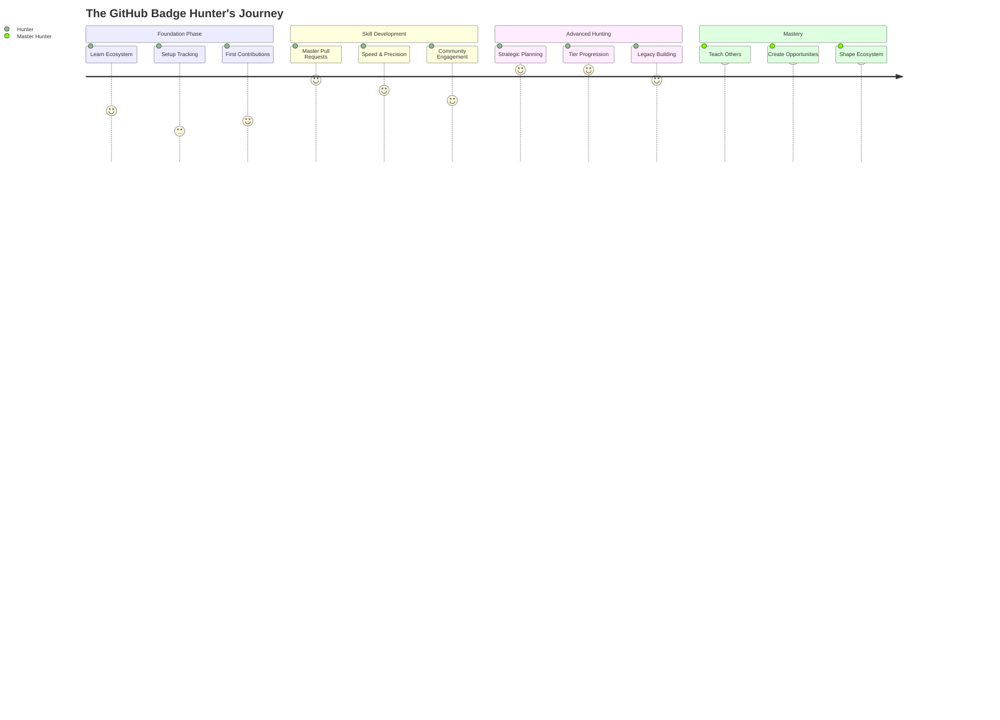
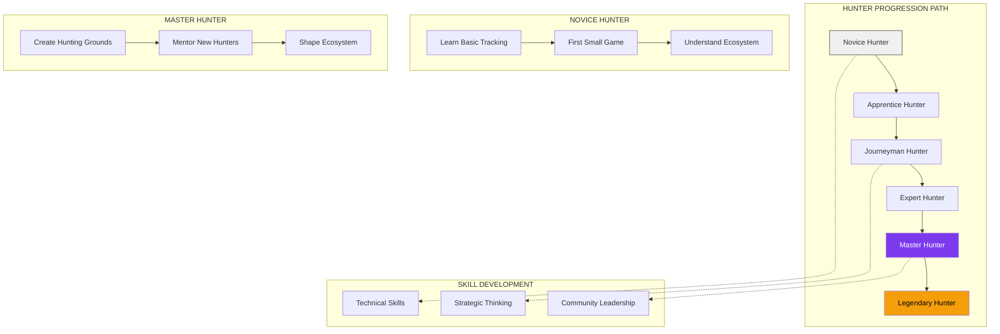
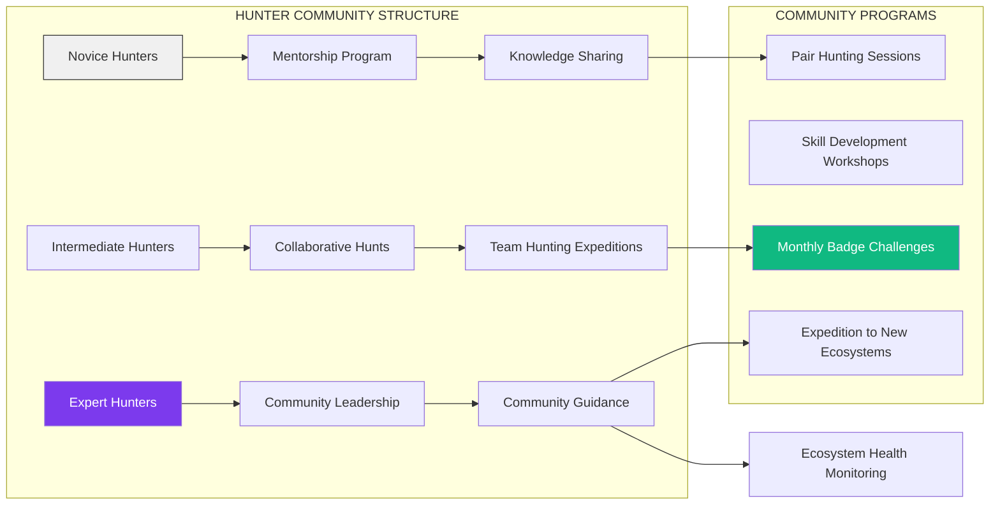
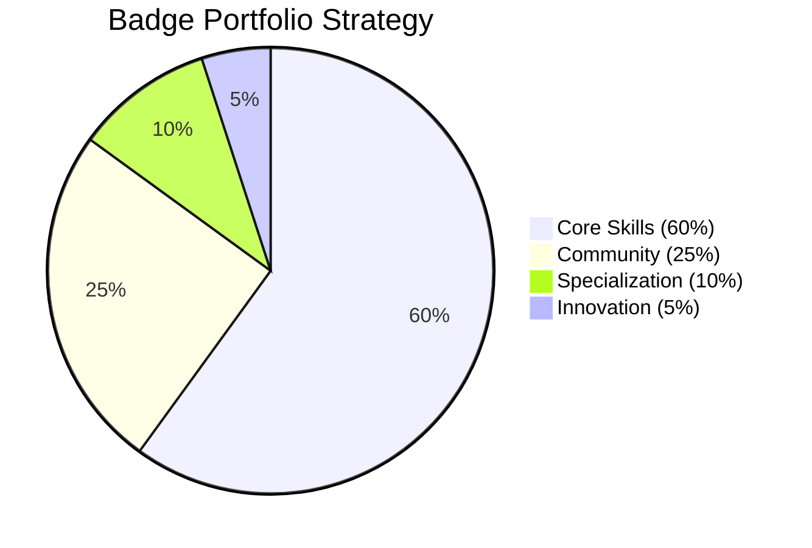
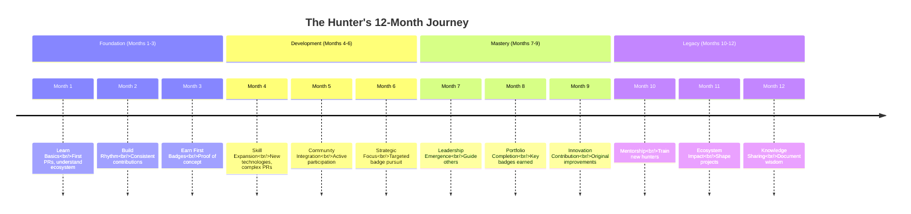

# 🏹 GitHub Badge Hunter: The Strategic Pursuit of Developer Prestige

<div align="center">


# 🎯 **The Art and Strategy of GitHub Badge Mastery**

### **Your Field Guide to Systematically Hunting, Earning, and Showcasing Every Prestigious Badge on GitHub**

[](https://github.com/AshrafMorningstar/GitHub-Badge-Hunter)
[](https://ashrafmorningstar.github.io/GitHub-Badge-Hunter/)
[](STRATEGIES.md)


</div>

## 🧭 Introduction: The Hunter's Philosophy

Welcome to **GitHub Badge Hunter**, a comprehensive strategic framework for the intentional, ethical, and systematic pursuit of GitHub's recognition system. This is not about mindless collection—it's about **intentional development**, **strategic contribution**, and **meaningful recognition** in the open-source ecosystem.

### 🎯 **The Hunter's Creed**

> "True hunters don't just collect trophies; they understand ecosystems, track patterns, master skills, and contribute meaningfully. Each badge represents a story of growth, a challenge overcome, and value created for the community."

## 🌐 The Complete Hunting Ecosystem



## 🏆 The Trophy Catalog: Your Hunting Targets

### 🎯 **Core Achievement Badges** 

| Trophy | Rarity | Hunting Strategy | Estimated Time | Skill Focus |
|--------|--------|------------------|----------------|-------------|
| **🦈 Pull Shark** | Common → Legendary | Quality PRs in strategic repositories | 2 days → 6 months | Collaboration, Code Quality |
| **⚡ Quickdraw** | Uncommon | Active monitoring + rapid response | 1-3 weeks | Responsiveness, Issue Triage |
| **🌟 Starstruck** | Rare | Create genuinely useful projects | 1-3 months | Project Quality, Marketing |
| **🧠 Galaxy Brain** | Uncommon | Helpful, accurate community answers | 2-4 weeks | Knowledge Sharing, Communication |
| **❤️ Public Sponsor** | Rare | Strategic support of key projects | Immediate | Community Support, OSS Funding |
| **👥 Pair Extraordinaire** | Very Rare | Intentional collaboration | 3-6 months | Teamwork, Code Review |

### 💎 **Status & Program Badges** 

| Badge | Type | Hunting Method | Value Proposition |
|-------|------|----------------|-------------------|
| **⚡ GitHub Pro** | Subscription | Paid upgrade or student program | Enhanced tools, visibility |
| **🐛 Security Bug Bounty** | Achievement | Security research & reporting | Security expertise proof |
| **🎓 Campus Expert** | Program | Campus program participation | Student leadership |
| **🛠️ Developer Program** | Membership | API/development focus | Technical platform expertise |
| **🛡️ Advisory Credit** | Contribution | Security advisory submission | Security community impact |

## 🏹 The Hunter's Toolkit & Methodology

### Strategic Planning Framework
```yaml
# Hunter's Strategic Plan Template
hunting_season: "Q4 2024"
primary_quarry: "Pull Shark Gold"
secondary_targets: ["Galaxy Brain Silver", "Quickdraw"]

terrain_analysis:
  current_position:
    achievements: ["Pull Shark Bronze", "Starstruck"]
    strengths: ["Frontend development", "Documentation"]
    opportunities: ["React ecosystem", "TypeScript projects"]
  
  environmental_factors:
    community_activity: "High in JavaScript/React spaces"
    competition_level: "Moderate"
    resource_availability: "Abundant learning materials"

hunting_strategies:
  ambush_tactics:
    - "Monitor popular repos for 'good first issue' labels"
    - "Set up GitHub notifications for specific technologies"
  
  tracking_methods:
    - "Use GitHub Explorer to find high-merge-rate repositories"
    - "Analyze maintainer response patterns"
  
  engagement_patterns:
    - "Start with documentation improvements"
    - "Progress to bug fixes, then small features"
    - "Build reputation before major contributions"

gear_checklist:
  essential_tools:
    - "Git proficiency"
    - "Code review skills"
    - "Communication etiquette"
  advanced_gear:
    - "Automated tracking systems"
    - "Contribution analytics"
    - "Network of fellow hunters"

success_metrics:
  short_term: "3 quality PRs weekly"
  medium_term: "Achieve Pull Shark Silver in 30 days"
  long_term: "Complete collection within 12 months"
```

### The Ethical Hunting Code
```markdown
# 🏹 The Hunter's Code of Honor

## Principle 1: Value Over Vanity
> "Hunt for growth, not just glory. Every contribution should make the ecosystem better."

## Principle 2: Sustainable Practices
> "Contribute at a pace you can maintain. Consistency beats intensity in the long hunt."

## Principle 3: Fair Chase
> "Earn badges through genuine skill and contribution, not exploitation of systems."

## Principle 4: Community Stewardship
> "Help fellow hunters. Share knowledge, review PRs, create opportunities."

## Principle 5: Ecosystem Health
> "Your hunting should strengthen projects, not burden maintainers."
```

## 🏗️ Project Architecture: The Hunting Lodge

```
GitHub-Badge-Hunter/
│
├── 📂 hunting-grounds/               # Targeted repositories & opportunities
│   ├── 📁 beginner-friendly/
│   │   ├── documentation-focus.md
│   │   ├── good-first-issues.md
│   │   └── welcoming-communities.md
│   │
│   ├── 📁 intermediate-targets/
│   │   ├── feature-development.md
│   │   ├── bug-hunting.md
│   │   └── performance-optimization.md
│   │
│   ├── 📁 advanced-quarry/
│   │   ├── architecture-changes.md
│   │   ├── security-improvements.md
│   │   └── ecosystem-projects.md
│   │
│   └── 📁 seasonal-opportunities/
│       ├── hackathons.md
│       ├── community-events.md
│       └── platform-updates.md
│
├── 📂 hunting-strategies/            # Proven methods & approaches
│   ├── 📁 pull-shark-mastery/
│   │   ├── bronze-tactics.md
│   │   ├── silver-acceleration.md
│   │   ├── gold-optimization.md
│   │   └── legendary-pursuit.md
│   │
│   ├── 📁 quickdraw-techniques/
│   │   ├── notification-setup.md
│   │   ├── rapid-assessment.md
│   │   ├── quality-under-pressure.md
│   │   └── sustainable-pacing.md
│   │
│   ├── 📁 community-engagement/
│   │   ├── discussion-strategy.md
│   │   ├── answer-crafting.md
│   │   ├── reputation-building.md
│   │   └── leadership-development.md
│   │
│   └── 📁 specialized-hunts/
│       ├── security-badges.md
│       ├── sponsorship-strategy.md
│       └── historical-badges.md
│
├── 📂 hunter-tools/                  # Tools for tracking & optimization
│   ├── 📁 tracking-systems/
│   │   ├── progress-dashboard.md
│   │   ├── contribution-log.md
│   │   ├── milestone-tracker.md
│   │   └── analytics-engine.md
│   │
│   ├── 📁 automation-tools/
│   │   ├── notification-manager.md
│   │   ├── opportunity-finder.md
│   │   ├── template-generator.md
│   │   └── workflow-optimizer.md
│   │
│   ├── 📁 analysis-tools/
│   │   ├── skill-gap-analyzer.md
│   │   ├── repository-scout.md
│   │   ├── maintainer-analyzer.md
│   │   └── success-predictor.md
│   │
│   └── 📁 communication-tools/
│       ├── pr-template-library.md
│       ├── issue-response-templates.md
│       ├── collaboration-proposals.md
│       └── networking-guides.md
│
├── 📂 trophy-room/                   # Showcase & portfolio
│   ├── 📁 achievement-display/
│   │   ├── dynamic-badges.md
│   │   ├── progress-visualization.md
│   │   ├── story-telling.md
│   │   └── portfolio-integration.md
│   │
│   ├── 📁 skill-demonstration/
│   │   ├── technical-skills.md
│   │   ├── soft-skills.md
│   │   ├── project-impact.md
│   │   └── career-narrative.md
│   │
│   └── 📁 hunting-journals/
│       ├── personal-log.md
│       ├── case-studies.md
│       ├── lessons-learned.md
│       └── legacy-documentation.md
│
└── README.md                        # This master guide
```

## 🎯 Strategic Hunting Methods

### The Tiered Progression System


### Intelligent Opportunity Identification
```python
# Opportunity Scout Algorithm
class BadgeOpportunityScout:
    def __init__(self, hunter_profile):
        self.profile = hunter_profile
        self.skills = hunter_profile['technical_skills']
        self.interests = hunter_profile['interests']
        self.achievement_gaps = self.analyze_gaps()
    
    def find_optimal_opportunities(self):
        opportunities = {
            'pull_requests': self.scan_for_pr_opportunities(),
            'discussions': self.find_relevant_discussions(),
            'issues': self.identify_quickdraw_targets(),
            'projects': self.discover_starstruck_potential()
        }
        
        return self.prioritize_opportunities(opportunities)
    
    def scan_for_pr_opportunities(self):
        """Find repositories matching hunter's skills and needs"""
        return {
            'documentation_fixes': self.find_docs_issues(),
            'good_first_issues': self.filter_beginner_friendly(),
            'skill_match_issues': self.match_technical_skills(),
            'high_impact': self.identify_high_value_projects()
        }
    
    def calculate_success_probability(self, opportunity):
        """Estimate likelihood of successful badge earn"""
        factors = {
            'skill_match': self.rate_skill_match(opportunity),
            'maintainer_activity': self.analyze_maintainer_response(),
            'project_health': self.assess_project_vitality(),
            'competition': self.estimate_competition_level()
        }
        
        return self.compute_probability(factors)
```

## 🛠️ Implementation Guide

### Setting Up Your Hunting Base
```bash
# Clone the Hunter's toolkit
git clone https://github.com/AshrafMorningstar/GitHub-Badge-Hunter.git
cd GitHub-Badge-Hunter

# Configure your hunting profile
python scripts/setup_hunter.py \
  --username your_github_username \
  --focus_areas "frontend, documentation, testing" \
  --target_badges "Pull Shark Gold, Galaxy Brain" \
  --time_commitment "10 hours weekly"

# Initialize tracking systems
python scripts/init_tracking.py \
  --progress_dashboard \
  --contribution_log \
  --opportunity_alerts

# Join the hunter community
python scripts/join_community.py \
  --discord \
  --hunting_partners \
  --mentorship_program
```

### The Weekly Hunting Ritual
```markdown
# Weekly Hunting Log Template

## Week of: YYYY-MM-DD
**Primary Quarry:** Pull Shark Silver (Current: 8/16 PRs)

### Daily Tracking
| Day | Activity | Target | Outcome | Lessons |
|-----|----------|--------|---------|---------|
| Mon | PR Review + Small Fix | React component library | ✅ Merged | Docs PRs fastest |
| Tue | Issue Triage | Quickdraw opportunity | ⚡ Earned! | Early morning best |
| Wed | Discussion Answers | TypeScript topics | 1/2 to Galaxy Brain | Quality > quantity |
| Thu | Feature Contribution | Utility library | 🔄 In Review | Complex PRs need patience |
| Fri | Community Engagement | Help newcomers | 👍 5 helped | Teaching reinforces knowledge |

### Weekly Analysis
**Progress Made:**
- Pull Shark count: +3 (now 11/16)
- New badge earned: Quickdraw
- Community reputation: Improved

**Adjustments for Next Week:**
1. Focus on 2-3 related repositories instead of 5+
2. Batch similar types of contributions
3. Schedule hunting during maintainer active hours

**Skills Developed:**
- PR description writing improved
- Faster issue assessment
- Better communication with maintainers
```

## 📊 Hunting Analytics & Performance

### Success Metrics Dashboard
| Metric | Target | Current | Trend | Insight |
|--------|--------|---------|-------|---------|
| **Weekly PR Velocity** | 3-5 quality PRs | 4.2 | 📈 Improving | Consistent contributor |
| **Merge Success Rate** | >85% | 92% | 📈 Excellent | High quality submissions |
| **Response Time** | <2 hours average | 1.8h | 📉 Improving | Efficient workflow |
| **Badge Earn Rate** | 1 new/month | 1.5/month | 📈 Ahead | Strategic focus effective |
| **Community Impact** | Growing positive | High | 📈 Strong | Valuable contributor |

### Predictive Success Modeling
```yaml
# Success Prediction Engine Output
hunter_profile: "frontend-specialist"
current_trajectory:
  predicted_achievements:
    - pull_shark_silver: "85% in 2 weeks"
    - galaxy_brain: "70% in 3 weeks"
    - starstruck: "60% in 1 month"
  
  skill_growth_projection:
    technical_skills: "Rapid growth in React/TypeScript"
    collaboration_skills: "Steady improvement"
    community_skills: "Accelerating growth"
  
  optimization_recommendations:
    immediate_focus: "Complete 5 more React-related PRs"
    skill_development: "Learn testing frameworks for wider contributions"
    network_building: "Connect with 3 more maintainers"
  
  risk_factors:
    burnout_risk: "Low (sustainable pace maintained)"
    opportunity_scarcity: "Medium (consider expanding tech stack)"
    competition_pressure: "Low (niche expertise advantage)"
```

## 🤝 The Hunter's Community

### Collaborative Hunting Framework


## 🚀 Getting Started: Your First Hunt

### Phase 1: Preparation (Week 1)
```markdown
## Day 1-2: Gear Up
- [ ] Complete hunter profile setup
- [ ] Configure notification systems
- [ ] Identify 3-5 target repositories
- [ ] Set up contribution tracking

## Day 3-4: Scout Territory
- [ ] Analyze repository activity patterns
- [ ] Identify "good first issue" opportunities
- [ ] Understand community guidelines
- [ ] Establish communication protocols

## Day 5-7: First Foray
- [ ] Submit first documentation PR
- [ ] Respond to 2-3 discussions
- [ ] Review others' PRs
- [ ] Log learnings and adjust strategy
```

### Phase 2: Skill Development (Weeks 2-4)
```yaml
focus: "Establish Consistent Contribution Rhythm"
targets:
  weekly_prs: 3-4 quality pull requests
  community_engagement: 5+ helpful interactions
  skill_expansion: Add 1-2 new technical areas

methods:
  - "Start with documentation and bug fixes"
  - "Progress to small features"
  - "Engage in technical discussions"
  - "Build relationships with maintainers"

success_indicators:
  - "Consistent PR merge rate >80%"
  - "Positive feedback from maintainers"
  - "Growing network of collaborators"
  - "First badge earned within 2 weeks"
```

## 📈 Advanced Hunting Strategies

### The Portfolio Approach


### Seasonal Hunting Calendar
```markdown
# Annual Hunting Calendar

## Q1: Foundation Building
- Focus: Core contribution skills
- Target: Pull Shark Bronze/Silver, Quickdraw
- Strategy: High-frequency, low-complexity contributions

## Q2: Community Engagement
- Focus: Discussion and collaboration
- Target: Galaxy Brain, Pair Extraordinaire
- Strategy: Quality over quantity in interactions

## Q3: Specialization
- Focus: Deep expertise areas
- Target: Project-specific impact, Starstruck
- Strategy: Major contributions to key projects

## Q4: Legacy & Leadership
- Focus: Mentoring and ecosystem impact
- Target: Community recognition, teaching
- Strategy: Create opportunities for others
```

## 🏆 The Hunter's Legacy

### Beyond Badges: Lasting Impact
| Achievement Type | Immediate Reward | Long-Term Value |
|------------------|------------------|-----------------|
| **Technical Skills** | Badge earned | Career advancement, project success |
| **Community Reputation** | Recognition now | Network, opportunities, influence |
| **Project Impact** | Contribution counted | Lasting improvements, user benefit |
| **Teaching Ability** | Help provided | Ripple effect through community |
| **Ecosystem Health** | Better projects | Sustainable open source future |

### The Complete Hunter's Journey


## 🔮 Future of the Hunt

### Evolution & Innovation Roadmap
**Phase 1: Enhanced Tools (Next 3 Months)**
- [ ] AI-powered opportunity matching
- [ ] Predictive success modeling
- [ ] Automated skill gap analysis
- [ ] Real-time collaboration platforms

**Phase 2: Community Expansion (Next 6 Months)**
- [ ] Global hunter network
- [ ] Specialized hunting guilds
- [ ] Cross-platform integration
- [ ] Educational partnerships

**Phase 3: Ecosystem Integration (Next 12 Months)**
- [ ] GitHub platform partnerships
- [ ] Corporate hunting programs
- [ ] Research on contribution patterns
- [ ] Standardization of recognition

---

<div align="center">

## 🏹 **Begin Your Hunt Today**

[](https://github.com/AshrafMorningstar/GitHub-Badge-Hunter)
[](COMMUNITY.md)
[](STRATEGIES.md)

### **Where Every Badge Tells a Story of Growth**

*This isn't about collecting pixels on a profile. It's about intentional skill development, meaningful contribution, and becoming the developer you aspire to be—with badges as mile markers on your journey.*

**Your GitHub legacy begins with your first intentional contribution.**

</div>

---

<div align="center">

*© 2024 GitHub Badge Hunter | The Strategic Approach to Developer Growth*  
*Transforming GitHub achievement pursuit from random collection to intentional development journey*

[](LICENSE)  
*Hunt ethically, contribute meaningfully, grow continuously.*

</div>
